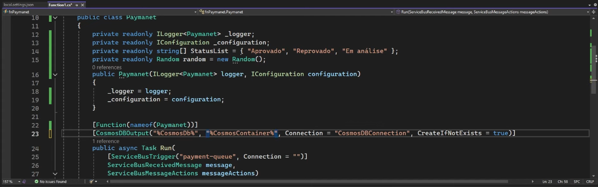

# app-aluguel-carros
Projeto Construção de uma Aplicação de Aluguel de Carros totalmente Cloud-Native (Exercício Bootcamp DIO)

Esquema:

Etapas no Azure:

1. Criar Resource group no Azure

2. Criar container registry

3. Criar Container App

4. Criar azure functions (em .Net)
- principal (consumption)
- fnapp-PaymentProcess

5. Criar service bus

6. Criar 2 bancos de dado 

- SQL Database Server

7. Criar Cosmos DB Account

8. Criar o Logic App

9. Criar o Key Vault

10. Criar fila ou Queue (fila-locacao-auto)

Concluída a arquitetura…

No painel de comando do Windows, acesse o diretório onde será criado o app rent-a-car

npm init -y

A Primary Connection Key vai no arquivo index.js, em const connectionString

enviar pro acr e registrar no container app

Fazer login no ACR (no vscode, cria-se o arquivo comandos.ps1)

Azure function RentProcess
- criar function

Tabela banco de dados sql

Conectar function RentProcess com o BD

—------------------------------------------------------------------

Construir Azure Function Payment

Configurar local.settings.json

Codigo function paymanet

—------------------------------------------------------------------